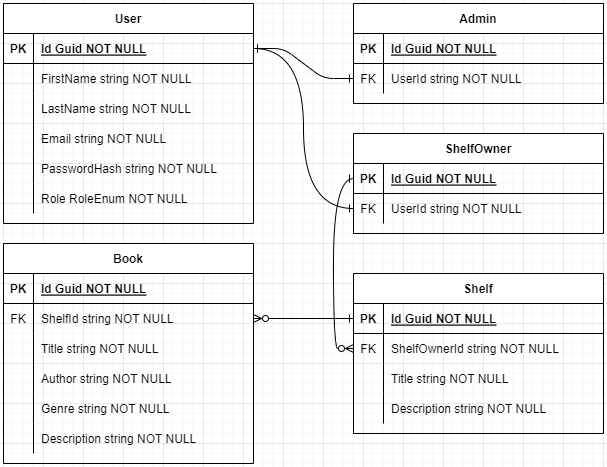

# BookshelfBuddy API

## Description

Această aplicație simplă permite utilizatorilor să caute cărți și să le salveze într-o bază de date. Aceștia pot, de asemenea, să vizualizeze cărțile salvate și să le șteargă din baza de date.

Cărțile sunt împărțite în rafturi. Utilizatorii pot adăuga cărți într-un raft, le pot muta, le pot înlătura dintr-un raft și de asemenea, să creeze rafturi noi.

## Table of Contents

- [BookshelfBuddy API](#bookshelfbuddy-api)
  - [Description](#description)
  - [Table of Contents](#table-of-contents)
  - [Setup](#setup)
	- [Installation](#installation)
    - [Clone Repository](#clone-repository)
    - [Database Creation](#database-creation)
    - [Running the API](#running-the-api)
    - [Register and Login](#register-and-login)
  - [Endpoints](#endpoints)
    - [Books](#books)
    - [Shelves](#shelves)
  - [Database Diagram](#database-diagram)

## Setup

### Installation

1. SQL Server Management Studio (SSMS):

a. Accesează pagina oficială de descărcare a SSMS de la Microsoft:
```bash
https://docs.microsoft.com/en-us/sql/ssms/download-sql-server-management-studio-ssms
```

b. Alege cea mai recentă versiune (SSMS 19.1) și dă clic pe link-ul corespunzător pentru descărcare.

c. Fișierul de instalare va fi descărcat pe computerul tău. Dublu-click pe el pentru a începe instalarea.

d. Urmează instrucțiunile din installer pentru a finaliza instalarea SSMS pe computerul tău.


2. Visual Studio 2022:

a. Accesează pagina oficială de descărcare a Visual Studio 2022 de la Microsoft:
```bash
https://visualstudio.microsoft.com/downloads/
````

b. Dă clic pe butonul "Download" pentru a descărca installer-ul pentru Visual Studio 2022.

c. Deschide installer-ul descărcat și urmează instrucțiunile pentru a instala Visual Studio 2022.

d. În timpul procesului de instalare, vei avea opțiunea de a selecta  specific workloads si individual components.

e. În fila "Workloads", selectează următoarele încărcări: ASP.NET and web development, .NET desktop development.

f. Realizează orice customizări sau selecții suplimentare în funcție de preferințele tale.

g. Continuă cu instalarea și urmează instrucțiunile finale pentru a finaliza instalarea Visual Studio 2022 pe computerul tău.


### Clone Repository

Clonează repozitoriul pe computerul tau local folosind următoarea comandă:

```bash
git clone https://github.com/tbtiberiu/BookshelfBuddy.git
```

### Database Creation

1. Deschide soluția în Visual Studio
2. Deschide Package Manager Console
3. Rulează comanda `Update-Database` în Package Manager Console
   ```
   PM> Update-Database
   ```

### Running the API

Rulează API-ul din Visual Studio (`F5`).

Se va deschide o fereastră de consolă care va afișa portul pe care rulează API-ul.

Deschide un browser și navighează la localhost:7027/api/swagger/index.html pentru a vizualiza interfața Swagger pentru API.

### Register and Login

Înainte de a utiliza API-ul, trebuie să înregistrezi un utilizator și să te autentifici. Utilizatorii pot avea rolurile de `ShelfOwner` (0) sau `Admin` (1).

Pentru a înregistra un utilizator, navighează către endpoint-ul `POST /api/Users/register` și dă clic pe butonul `Try it out`.

Introdu următorul JSON în secțiunea `Request body`:

```json
{
  "firstName": "John",
  "lastName": "Doe",
  "email": "test@example.com",
  "password": "test",
  "role": 0
}
```

Dă clic pe butonul `Execute` pentru a înregistra utilizatorul.

Pentru a te autentifica, navighează către endpoint-ul `POST /api/Users/login` și dă clic pe butonul `Try it out`.

Introdu următorul JSON în secțiunea `Request body`:

```json
{
  "email": "test@example.com",
  "password": "test"
}
```

Dă clic pe butonul `Execute` pentru a te autentifica.

Răspunsul va conține un `token` pe care îl poți utiliza pentru a autentifica cererile pentru deținătorul raftului creat.

Pentru a autentifica cererile, dă clic pe butonul `Authorize` în partea de sus a interfeței Swagger.

Introdu `bearer <token>` în câmpul `Value` și dă clic pe butonul `Authorize`.

`Token-ul` va fi adăugat automat în antetul `Authorization` pentru toate cererile.

Acum poți utiliza API-ul pentru a căuta cărți, a crea rafturi, a adăuga cărți în rafturi, a muta cărți între rafturi și a șterge cărți din rafturi.

## Endpoints

### Books

- `GET /api/Books` va returna toate cărțile din baza de date.

- `GET /api/Books/{id}` va returna cartea cu id-ul specificat.

- `POST /api/Books` va adăuga o carte pe un raft.

- `PUT /api/Books` va actualiza cartea specificată.

- `DELETE /api/Books/{id}` va șterge cartea cu id-ul specificat.

### Shelves

- `GET /api/Shelves` va returna toate rafturile din baza de date.

- `GET /api/Shelves/{id}` va returna raftul cu id-ul specificat.

- `POST /api/Shelves/admin` va adăuga un raft în baza de date pentru utilizatorul admin.

- `POST /api/Shelves/shelfOwner` va adăuga un raft în baza de date pentru utilizatorul autentificat.

- `PUT /api/Shelves` va actualiza raftul specificat.

- `DELETE /api/Shelves/{id}` va șterge raftul cu id-ul specificat.

## Database Diagram



[Back to Top](#bookshelfbuddy-api)
